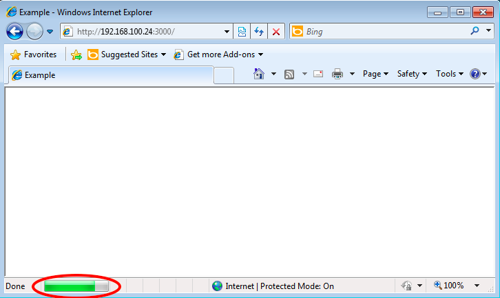

socke.io-ie8-loading-example
=======================

A sample app to illustrate ie8 loading triggered by socket.io

### Problem

IE8 loading bar keeps running while sending events from the client.
It has not occured before updating to socket.io 1.0.x.

##### index.html

```
var socket = io.connect('http://192.168.100.24:4000');
socket.on('connect', function() {
  i = 0;
  setInterval(function() {
    socket.emit('cnt', i++);
  }, 1000);
});
```

Instructions:

1. Change localhost to your hostname in index.html
2. Start the server (`node app.js`)
3. Access to yourhost:3000 with IE8

Then:

You will see the loading bar keeps running.

